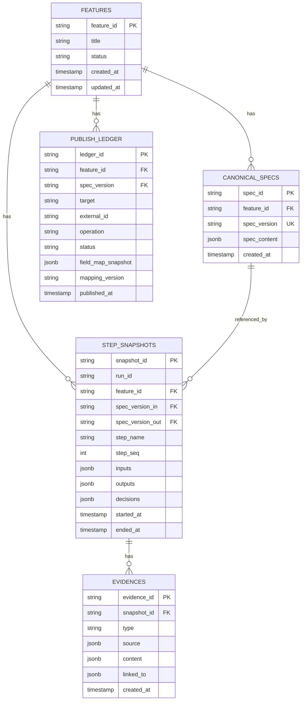

# Canonical Spec 数据库结构文档

本文档定义了 Canonical Spec 工具的后端数据库完整结构，包括表定义、字段说明、约束规则和关系图。

## 版本信息

- **Schema 版本**: 1.0.0
- **最后更新**: 2026-01-24

## 数据库设计原则

1. **版本化存储**: Canonical Spec 采用版本化存储，每个 `spec_version` 对应一条记录
2. **审计追溯**: 所有步骤执行都记录快照，支持完整追溯
3. **幂等保证**: Publish Ledger 保证发布操作的幂等性
4. **可扩展性**: 表结构支持未来扩展（如多执行系统、平台化）

## ER 关系图



## 数据表定义

### 1. features - 功能主表

存储功能的基本信息和状态。

| 字段名 | 类型 | 约束 | 说明 |
|--------|------|------|------|
| `feature_id` | VARCHAR(50) | PRIMARY KEY | 功能 ID，格式: `F-YYYY-NNN` |
| `title` | VARCHAR(500) | NOT NULL | 功能标题 |
| `status` | VARCHAR(20) | NOT NULL | 状态: `draft`, `clarifying`, `executable_ready`, `published`, `hold`, `drop` |
| `created_at` | TIMESTAMP | NOT NULL | 创建时间 |
| `updated_at` | TIMESTAMP | NOT NULL | 更新时间 |

**索引**:
- `idx_features_status`: `(status)`
- `idx_features_created_at`: `(created_at DESC)`

**约束**:
- `status` 必须为有效枚举值
- `feature_id` 格式必须符合 `F-YYYY-NNN` 模式

**示例数据**:
```sql
INSERT INTO features (feature_id, title, status, created_at, updated_at)
VALUES ('F-2026-001', '用户登录功能', 'clarifying', '2026-01-13 10:00:00', '2026-01-13 10:05:00');
```

---

### 2. canonical_specs - Spec 版本存储表

存储 Canonical Spec 的版本化数据，每个版本一条记录。

| 字段名 | 类型 | 约束 | 说明 |
|--------|------|------|------|
| `spec_id` | UUID | PRIMARY KEY | Spec 记录唯一标识 |
| `feature_id` | VARCHAR(50) | FOREIGN KEY, NOT NULL | 关联的功能 ID |
| `spec_version` | VARCHAR(50) | UNIQUE, NOT NULL | Spec 版本，格式: `S-YYYYMMDD-NNNN` |
| `spec_content` | JSONB | NOT NULL | Canonical Spec 完整 JSON 内容 |
| `created_at` | TIMESTAMP | NOT NULL | 创建时间 |

**索引**:
- `idx_canonical_specs_feature_id`: `(feature_id)`
- `idx_canonical_specs_version`: `(spec_version)`
- `idx_canonical_specs_feature_version`: `(feature_id, spec_version)` (唯一索引)

**约束**:
- `spec_version` 必须唯一（全局唯一）
- `spec_version` 格式必须符合 `S-YYYYMMDD-NNNN` 模式
- `spec_content` 必须符合 Canonical Spec Schema（应用层校验）

**JSONB 字段结构** (`spec_content`):
```json
{
  "schema_version": "1.0",
  "feature": {
    "feature_id": "F-2026-001",
    "title": "用户登录功能",
    "status": "clarifying"
  },
  "project_context_ref": {
    "project_id": "P-xxx",
    "context_version": "C-12",
    "project_record_id": "recv83AoVSDMQP"
  },
  "spec": {
    "goal": "...",
    "non_goals": [],
    "acceptance_criteria": []
  },
  "planning": {
    "tasks": [],
    "vv": []
  },
  "quality": {
    "completeness_score": 0.65,
    "missing_fields": []
  },
  "decision": {
    "recommendation": "go",
    "rationale": []
  },
  "meta": {
    "spec_version": "S-20260113-0001",
    "source_artifacts": []
  }
}
```

**示例数据**:
```sql
INSERT INTO canonical_specs (spec_id, feature_id, spec_version, spec_content, created_at)
VALUES (
  gen_random_uuid(),
  'F-2026-001',
  'S-20260113-0001',
  '{"schema_version": "1.0", "feature": {...}, "spec": {...}}'::jsonb,
  '2026-01-13 10:00:00'
);
```

**查询示例**:
```sql
-- 获取功能的最新 Spec 版本
SELECT spec_content
FROM canonical_specs
WHERE feature_id = 'F-2026-001'
ORDER BY spec_version DESC
LIMIT 1;

-- 获取特定版本的 Spec
SELECT spec_content
FROM canonical_specs
WHERE feature_id = 'F-2026-001' AND spec_version = 'S-20260113-0001';
```

---

### 3. step_snapshots - 步骤快照表

存储 Pipeline 每个步骤的执行快照，用于审计和追溯。

| 字段名 | 类型 | 约束 | 说明 |
|--------|------|------|------|
| `snapshot_id` | UUID | PRIMARY KEY | 快照唯一标识 |
| `run_id` | VARCHAR(50) | NOT NULL | 执行 ID，格式: `R-YYYYMMDD-NNNN` |
| `feature_id` | VARCHAR(50) | FOREIGN KEY, NOT NULL | 关联的功能 ID |
| `spec_version_in` | VARCHAR(50) | FOREIGN KEY | 输入 Spec 版本 |
| `spec_version_out` | VARCHAR(50) | FOREIGN KEY | 输出 Spec 版本（可为 NULL） |
| `step_name` | VARCHAR(50) | NOT NULL | 步骤名称: `ingest`, `compile`, `validate_gates`, `clarify_questions`, `apply_answers`, `plan_tasks`, `generate_vv`, `manual_review`, `publish` |
| `step_seq` | INTEGER | NOT NULL | 步骤执行顺序（从 1 开始） |
| `inputs` | JSONB | NOT NULL | 步骤输入（JSON） |
| `outputs` | JSONB | NOT NULL | 步骤输出（JSON） |
| `decisions` | JSONB | | 决策记录（数组） |
| `errors` | JSONB | | 错误记录（数组） |
| `started_at` | TIMESTAMP | NOT NULL | 开始时间 |
| `ended_at` | TIMESTAMP | | 结束时间（失败时可能为 NULL） |

**索引**:
- `idx_step_snapshots_feature_id`: `(feature_id)`
- `idx_step_snapshots_run_id`: `(run_id)`
- `idx_step_snapshots_feature_step`: `(feature_id, step_name, started_at DESC)`

**约束**:
- `step_name` 必须为有效枚举值
- `step_seq` 必须 > 0
- `spec_version_out` 可为 NULL（步骤失败时）

**JSONB 字段结构** (`inputs`):
```json
{
  "canonical_spec_ref": "S-20260113-0001",
  "context_ref": "C-12",
  "user_answer_ref": null
}
```

**JSONB 字段结构** (`outputs`):
```json
{
  "gate_result": {
    "gate_s": {"pass": true},
    "gate_t": {"pass": false},
    "completeness_score": 0.65
  },
  "spec_version_out": "S-20260113-0002"
}
```

**JSONB 字段结构** (`decisions`):
```json
[
  {
    "decision": "enter_clarify_loop",
    "reason": "GateT fail: tasks missing",
    "next_step": "clarify_questions"
  }
]
```

**示例数据**:
```sql
INSERT INTO step_snapshots (
  snapshot_id, run_id, feature_id, spec_version_in, spec_version_out,
  step_name, step_seq, inputs, outputs, decisions, started_at, ended_at
)
VALUES (
  gen_random_uuid(),
  'R-20260113-0008',
  'F-2026-001',
  'S-20260113-0001',
  'S-20260113-0002',
  'apply_answers',
  5,
  '{"canonical_spec_ref": "S-20260113-0001", "user_answer_ref": "A-001"}'::jsonb,
  '{"spec_version_out": "S-20260113-0002"}'::jsonb,
  '[]'::jsonb,
  '2026-01-13 10:05:00',
  '2026-01-13 10:05:02'
);
```

---

### 4. evidences - 证据存储表

存储步骤执行中引用的证据（文档片段、代码引用等）。

| 字段名 | 类型 | 约束 | 说明 |
|--------|------|------|------|
| `evidence_id` | VARCHAR(50) | PRIMARY KEY | 证据 ID，格式: `E-NNNN` |
| `snapshot_id` | UUID | FOREIGN KEY, NOT NULL | 关联的快照 ID |
| `type` | VARCHAR(20) | NOT NULL | 证据类型: `quote`, `doc`, `repo`, `file`, `api_result`, `log` |
| `source` | JSONB | NOT NULL | 来源信息 |
| `content` | JSONB | NOT NULL | 证据内容 |
| `linked_to` | JSONB | NOT NULL | 关联目标（数组） |
| `created_at` | TIMESTAMP | NOT NULL | 创建时间 |

**索引**:
- `idx_evidences_snapshot_id`: `(snapshot_id)`
- `idx_evidences_type`: `(type)`

**约束**:
- `type` 必须为有效枚举值
- `evidence_id` 格式必须符合 `E-NNNN` 模式

**JSONB 字段结构** (`source`):
```json
{
  "ref": "doc://task_md#L20-L35",
  "hash": "sha256:abc123..."
}
```

**JSONB 字段结构** (`content`):
```json
{
  "excerpt": "不超过必要的短引用/摘要",
  "note": "这段证据用于支持某个字段抽取"
}
```

**JSONB 字段结构** (`linked_to`):
```json
[
  {"spec_path": "spec.goal"},
  {"step": "compile"}
]
```

**示例数据**:
```sql
INSERT INTO evidences (
  evidence_id, snapshot_id, type, source, content, linked_to, created_at
)
VALUES (
  'E-1001',
  '550e8400-e29b-41d4-a716-446655440000',
  'quote',
  '{"ref": "doc://task_md#L20-L35", "hash": "sha256:abc123"}'::jsonb,
  '{"excerpt": "用户希望实现登录功能", "note": "支持 Gate S 判定"}'::jsonb,
  '[{"spec_path": "spec.goal"}]'::jsonb,
  '2026-01-13 10:04:00'
);
```

---

### 5. publish_ledger - 发布记录表

存储发布到执行系统（Feishu）的记录，保证幂等性。

| 字段名 | 类型 | 约束 | 说明 |
|--------|------|------|------|
| `ledger_id` | UUID | PRIMARY KEY | Ledger 记录唯一标识 |
| `feature_id` | VARCHAR(50) | FOREIGN KEY, NOT NULL | 关联的功能 ID |
| `spec_version` | VARCHAR(50) | FOREIGN KEY, NOT NULL | Spec 版本 |
| `target` | VARCHAR(20) | NOT NULL | 目标系统: `feishu`, `jira`, `github_issues` (MVP 仅 `feishu`) |
| `external_id` | VARCHAR(100) | NOT NULL | 执行系统返回的记录 ID |
| `operation` | VARCHAR(20) | NOT NULL | 操作类型: `created`, `updated`, `noop` |
| `status` | VARCHAR(20) | NOT NULL | 状态: `active`, `superseded`, `rolled_back`, `failed` |
| `field_map_snapshot` | JSONB | NOT NULL | 字段映射快照（用于审计） |
| `mapping_version` | VARCHAR(10) | NOT NULL | 映射配置版本 |
| `published_at` | TIMESTAMP | NOT NULL | 发布时间 |

**索引**:
- `idx_publish_ledger_feature_id`: `(feature_id)`
- `idx_publish_ledger_feature_target_version`: `(feature_id, target, spec_version)` (唯一索引，幂等键)
- `idx_publish_ledger_external_id`: `(external_id)`
- `idx_publish_ledger_status`: `(status)`

**约束**:
- `target` 必须为有效枚举值
- `operation` 必须为有效枚举值
- `status` 必须为有效枚举值
- 幂等键 `(feature_id, target, spec_version)` 必须唯一

**JSONB 字段结构** (`field_map_snapshot`):
```json
{
  "反馈问题": "feature.title",
  "用户故事": "spec.goal + spec.acceptance_criteria",
  "需求状态": "待排期",
  "需求负责人": [],
  "执行成员": [],
  "优先级": "中",
  "需求类型": "新功能",
  "所属项目": ["recv83AoVSDMQP"]
}
```

**示例数据**:
```sql
INSERT INTO publish_ledger (
  ledger_id, feature_id, spec_version, target, external_id,
  operation, status, field_map_snapshot, mapping_version, published_at
)
VALUES (
  gen_random_uuid(),
  'F-2026-001',
  'S-20260113-0004',
  'feishu',
  'recv83AoVSDMQP',
  'created',
  'active',
  '{"反馈问题": "用户登录功能", "用户故事": "..."}'::jsonb,
  '1.0',
  '2026-01-13 10:30:00'
);
```

**查询示例**:
```sql
-- 检查幂等性（查询是否已发布）
SELECT *
FROM publish_ledger
WHERE feature_id = 'F-2026-001'
  AND target = 'feishu'
  AND spec_version = 'S-20260113-0004'
  AND status = 'active';

-- 获取功能的所有发布记录
SELECT *
FROM publish_ledger
WHERE feature_id = 'F-2026-001'
ORDER BY published_at DESC;
```

---

## 数据关系说明

### 1. Feature → Canonical Specs (一对多)

- 一个 Feature 可以有多个 Spec 版本
- 通过 `feature_id` 关联
- 每个 Spec 版本通过 `spec_version` 唯一标识

### 2. Feature → Step Snapshots (一对多)

- 一个 Feature 可以有多个步骤快照
- 通过 `feature_id` 关联
- 每个快照记录一次 Pipeline 执行中的一步

### 3. Step Snapshots → Evidences (一对多)

- 一个步骤快照可以引用多个证据
- 通过 `snapshot_id` 关联
- 证据用于追溯步骤决策的依据

### 4. Feature → Publish Ledger (一对多)

- 一个 Feature 可以有多个发布记录（不同版本）
- 通过 `feature_id` 关联
- 幂等键 `(feature_id, target, spec_version)` 保证同一版本不重复发布

### 5. Canonical Specs ↔ Step Snapshots (多对多)

- 一个 Spec 版本可以被多个步骤引用（作为输入）
- 一个步骤可以产生新的 Spec 版本（作为输出）
- 通过 `spec_version_in` 和 `spec_version_out` 关联

## 数据完整性约束

### 外键约束

```sql
-- canonical_specs.feature_id → features.feature_id
ALTER TABLE canonical_specs
ADD CONSTRAINT fk_canonical_specs_feature
FOREIGN KEY (feature_id) REFERENCES features(feature_id)
ON DELETE CASCADE;

-- step_snapshots.feature_id → features.feature_id
ALTER TABLE step_snapshots
ADD CONSTRAINT fk_step_snapshots_feature
FOREIGN KEY (feature_id) REFERENCES features(feature_id)
ON DELETE CASCADE;

-- step_snapshots.spec_version_in → canonical_specs.spec_version
ALTER TABLE step_snapshots
ADD CONSTRAINT fk_step_snapshots_spec_in
FOREIGN KEY (spec_version_in) REFERENCES canonical_specs(spec_version)
ON DELETE SET NULL;

-- step_snapshots.spec_version_out → canonical_specs.spec_version
ALTER TABLE step_snapshots
ADD CONSTRAINT fk_step_snapshots_spec_out
FOREIGN KEY (spec_version_out) REFERENCES canonical_specs(spec_version)
ON DELETE SET NULL;

-- evidences.snapshot_id → step_snapshots.snapshot_id
ALTER TABLE evidences
ADD CONSTRAINT fk_evidences_snapshot
FOREIGN KEY (snapshot_id) REFERENCES step_snapshots(snapshot_id)
ON DELETE CASCADE;

-- publish_ledger.feature_id → features.feature_id
ALTER TABLE publish_ledger
ADD CONSTRAINT fk_publish_ledger_feature
FOREIGN KEY (feature_id) REFERENCES features(feature_id)
ON DELETE CASCADE;

-- publish_ledger.spec_version → canonical_specs.spec_version
ALTER TABLE publish_ledger
ADD CONSTRAINT fk_publish_ledger_spec
FOREIGN KEY (spec_version) REFERENCES canonical_specs(spec_version)
ON DELETE RESTRICT;
```

### 检查约束

```sql
-- features.status 枚举值检查
ALTER TABLE features
ADD CONSTRAINT chk_features_status
CHECK (status IN ('draft', 'clarifying', 'executable_ready', 'published', 'hold', 'drop'));

-- canonical_specs.spec_version 格式检查
ALTER TABLE canonical_specs
ADD CONSTRAINT chk_canonical_specs_version_format
CHECK (spec_version ~ '^S-\d{8}-\d{4}$');

-- step_snapshots.step_name 枚举值检查
ALTER TABLE step_snapshots
ADD CONSTRAINT chk_step_snapshots_step_name
CHECK (step_name IN ('ingest', 'compile', 'validate_gates', 'clarify_questions', 
                     'apply_answers', 'plan_tasks', 'generate_vv', 'manual_review', 'publish'));

-- publish_ledger.target 枚举值检查
ALTER TABLE publish_ledger
ADD CONSTRAINT chk_publish_ledger_target
CHECK (target IN ('feishu', 'jira', 'github_issues'));

-- publish_ledger.operation 枚举值检查
ALTER TABLE publish_ledger
ADD CONSTRAINT chk_publish_ledger_operation
CHECK (operation IN ('created', 'updated', 'noop'));

-- publish_ledger.status 枚举值检查
ALTER TABLE publish_ledger
ADD CONSTRAINT chk_publish_ledger_status
CHECK (status IN ('active', 'superseded', 'rolled_back', 'failed'));
```

## 数据库初始化脚本示例

```sql
-- 创建扩展（PostgreSQL）
CREATE EXTENSION IF NOT EXISTS "uuid-ossp";

-- 创建表
CREATE TABLE features (
    feature_id VARCHAR(50) PRIMARY KEY,
    title VARCHAR(500) NOT NULL,
    status VARCHAR(20) NOT NULL,
    created_at TIMESTAMP NOT NULL DEFAULT CURRENT_TIMESTAMP,
    updated_at TIMESTAMP NOT NULL DEFAULT CURRENT_TIMESTAMP,
    CONSTRAINT chk_features_status
        CHECK (status IN ('draft', 'clarifying', 'executable_ready', 'published', 'hold', 'drop'))
);

CREATE TABLE canonical_specs (
    spec_id UUID PRIMARY KEY DEFAULT gen_random_uuid(),
    feature_id VARCHAR(50) NOT NULL,
    spec_version VARCHAR(50) UNIQUE NOT NULL,
    spec_content JSONB NOT NULL,
    created_at TIMESTAMP NOT NULL DEFAULT CURRENT_TIMESTAMP,
    CONSTRAINT fk_canonical_specs_feature
        FOREIGN KEY (feature_id) REFERENCES features(feature_id) ON DELETE CASCADE,
    CONSTRAINT chk_canonical_specs_version_format
        CHECK (spec_version ~ '^S-\d{8}-\d{4}$')
);

CREATE TABLE step_snapshots (
    snapshot_id UUID PRIMARY KEY DEFAULT gen_random_uuid(),
    run_id VARCHAR(50) NOT NULL,
    feature_id VARCHAR(50) NOT NULL,
    spec_version_in VARCHAR(50),
    spec_version_out VARCHAR(50),
    step_name VARCHAR(50) NOT NULL,
    step_seq INTEGER NOT NULL,
    inputs JSONB NOT NULL,
    outputs JSONB NOT NULL,
    decisions JSONB DEFAULT '[]'::jsonb,
    errors JSONB DEFAULT '[]'::jsonb,
    started_at TIMESTAMP NOT NULL DEFAULT CURRENT_TIMESTAMP,
    ended_at TIMESTAMP,
    CONSTRAINT fk_step_snapshots_feature
        FOREIGN KEY (feature_id) REFERENCES features(feature_id) ON DELETE CASCADE,
    CONSTRAINT fk_step_snapshots_spec_in
        FOREIGN KEY (spec_version_in) REFERENCES canonical_specs(spec_version) ON DELETE SET NULL,
    CONSTRAINT fk_step_snapshots_spec_out
        FOREIGN KEY (spec_version_out) REFERENCES canonical_specs(spec_version) ON DELETE SET NULL,
    CONSTRAINT chk_step_snapshots_step_name
        CHECK (step_name IN ('ingest', 'compile', 'validate_gates', 'clarify_questions', 
                             'apply_answers', 'plan_tasks', 'generate_vv', 'manual_review', 'publish')),
    CONSTRAINT chk_step_snapshots_step_seq
        CHECK (step_seq > 0)
);

CREATE TABLE evidences (
    evidence_id VARCHAR(50) PRIMARY KEY,
    snapshot_id UUID NOT NULL,
    type VARCHAR(20) NOT NULL,
    source JSONB NOT NULL,
    content JSONB NOT NULL,
    linked_to JSONB NOT NULL,
    created_at TIMESTAMP NOT NULL DEFAULT CURRENT_TIMESTAMP,
    CONSTRAINT fk_evidences_snapshot
        FOREIGN KEY (snapshot_id) REFERENCES step_snapshots(snapshot_id) ON DELETE CASCADE,
    CONSTRAINT chk_evidences_type
        CHECK (type IN ('quote', 'doc', 'repo', 'file', 'api_result', 'log'))
);

CREATE TABLE publish_ledger (
    ledger_id UUID PRIMARY KEY DEFAULT gen_random_uuid(),
    feature_id VARCHAR(50) NOT NULL,
    spec_version VARCHAR(50) NOT NULL,
    target VARCHAR(20) NOT NULL,
    external_id VARCHAR(100) NOT NULL,
    operation VARCHAR(20) NOT NULL,
    status VARCHAR(20) NOT NULL,
    field_map_snapshot JSONB NOT NULL,
    mapping_version VARCHAR(10) NOT NULL,
    published_at TIMESTAMP NOT NULL DEFAULT CURRENT_TIMESTAMP,
    CONSTRAINT fk_publish_ledger_feature
        FOREIGN KEY (feature_id) REFERENCES features(feature_id) ON DELETE CASCADE,
    CONSTRAINT fk_publish_ledger_spec
        FOREIGN KEY (spec_version) REFERENCES canonical_specs(spec_version) ON DELETE RESTRICT,
    CONSTRAINT chk_publish_ledger_target
        CHECK (target IN ('feishu', 'jira', 'github_issues')),
    CONSTRAINT chk_publish_ledger_operation
        CHECK (operation IN ('created', 'updated', 'noop')),
    CONSTRAINT chk_publish_ledger_status
        CHECK (status IN ('active', 'superseded', 'rolled_back', 'failed')),
    CONSTRAINT uk_publish_ledger_feature_target_version
        UNIQUE (feature_id, target, spec_version)
);

-- 创建索引
CREATE INDEX idx_features_status ON features(status);
CREATE INDEX idx_features_created_at ON features(created_at DESC);

CREATE INDEX idx_canonical_specs_feature_id ON canonical_specs(feature_id);
CREATE INDEX idx_canonical_specs_version ON canonical_specs(spec_version);
CREATE UNIQUE INDEX idx_canonical_specs_feature_version ON canonical_specs(feature_id, spec_version);

CREATE INDEX idx_step_snapshots_feature_id ON step_snapshots(feature_id);
CREATE INDEX idx_step_snapshots_run_id ON step_snapshots(run_id);
CREATE INDEX idx_step_snapshots_feature_step ON step_snapshots(feature_id, step_name, started_at DESC);

CREATE INDEX idx_evidences_snapshot_id ON evidences(snapshot_id);
CREATE INDEX idx_evidences_type ON evidences(type);

CREATE INDEX idx_publish_ledger_feature_id ON publish_ledger(feature_id);
CREATE INDEX idx_publish_ledger_external_id ON publish_ledger(external_id);
CREATE INDEX idx_publish_ledger_status ON publish_ledger(status);
```

## 数据迁移策略

### 版本升级

当 Schema 需要升级时：

1. **新增字段**: 使用 `ALTER TABLE ADD COLUMN`，设置默认值
2. **修改字段类型**: 使用 `ALTER TABLE ALTER COLUMN TYPE`，注意数据转换
3. **新增约束**: 先检查现有数据是否符合约束，再添加
4. **删除字段**: 先标记为废弃，后续版本删除

### 数据备份

- 定期备份 `canonical_specs` 表（版本化数据）
- 备份 `publish_ledger` 表（发布记录）
- 可选择性备份 `step_snapshots` 和 `evidences`（审计数据，量大）

## 性能优化建议

1. **JSONB 查询优化**: 对 `spec_content`、`inputs`、`outputs` 等 JSONB 字段创建 GIN 索引（如需要）
2. **分区策略**: 如果 `step_snapshots` 表数据量大，可按时间分区
3. **归档策略**: 定期归档旧版本的 `step_snapshots` 和 `evidences` 数据

## 参考文档

- [Canonical Spec MVP Schema](./mvp_contracts/01_canonical_spec_mvp_schema.md)
- [Orchestrator Steps I/O](./mvp_contracts/03_orchestrator_steps_io.md)
- [Feishu Publish Contract](./mvp_contracts/04_feishu_publish_contract.md)
