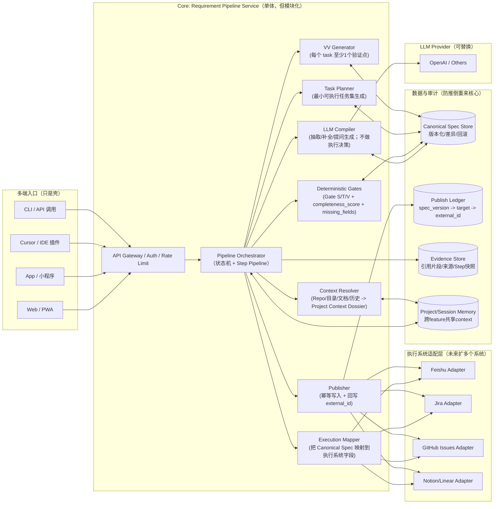

下面给你一张 **“方案1（单体服务） + 方案3（确定性骨架）”** 的技术架构图（偏工程视角、可演进到方案2/4），我会把**哪些地方是未来不推倒重来的关键接口**标出来。

---

## 技术架构图（方案1 + 方案3骨架）



---

## 怎么读这张图（抓你最关心的“不会推倒重来”的点）

### 1) **Canonical Spec Store 是唯一事实源**
- 任何入口（Web/App/Cursor/CLI）最终都要把输入“编译”成 Canonical Spec  
- 以后你拆服务（方案2）或者做平台（方案4），都不改这件事  
- **推倒重来的最大来源**就是“核心事实不统一”，这里把它钉死了

### 2) **确定性骨架（VALID）把 AI 关进笼子**
- Gate S/T/V、completeness_score、missing_fields 都在这里做“可解释判定”
- LLM 只负责抽取/生成问题，不负责判定“是否通过”
- 这样你面对“输入质量参差”的用户群也能稳定

### 3) **Adapter 是未来兼容方案2（多执行系统）的关键**
- 执行系统（飞书/Jira/GitHub…）全在 Adapter 层
- Core 只输出 Canonical Spec，不写任何飞书字段
- 所以你未来想“接更多执行系统”，只要加 Adapter，不动 Core

### 4) **Step Pipeline + Evidence 是未来兼容方案4（平台化）的关键**
- Orchestrator 不是一坨逻辑，而是一系列 Step（Ingest→Context→Compile→Validate→Clarify→Plan→VV→Publish）
- 每一步都把输入输出快照、证据写进 Evidence Store
- 未来平台化（可视化编排）就是把 Step “配置化/可重排”，而不是重写逻辑

### 5) **Publish Ledger 保证幂等与可追溯**
- 记录 spec_version → target_system → external_id
- 未来拆服务、重试、回滚都靠它，否则多系统同步会变成灾难

---

## MVP 入口点：Tooling-First（单一入口）

### 入口命令定义
MVP 阶段采用 **CLI/命令式工具**作为单一入口，嵌入现有工具链（优先 `feishu-onboarding-tool`），避免新起 Web/API 服务。

**核心命令集**（建议命名）：
- `canonical run <input>`：执行完整 Pipeline（输入 → 编译 → Gate → 澄清/任务规划 → 人工确认 → 发布）
- `canonical answer <feature_id> <answers>`：提交澄清答案，触发 `apply_answers` step
- `canonical review <feature_id> <decision>`：人工确认（go/hold/drop），触发 `manual_review` step
- `canonical publish <feature_id>`：发布到 Feishu（需 `executable_ready` + `review_decision=go`）

**命令交互流程**：
```bash
# 1. 初始输入
$ canonical run "添加用户登录功能"
→ 生成 spec_version: S-20260113-0001
→ Gate S fail: 缺 acceptance_criteria
→ 进入 clarifying 状态
→ 输出澄清问题到 stdout

# 2. 提交答案（CLI prompt 或文件输入）
$ canonical answer F-2026-001 --file answers.json
→ 生成 spec_version: S-20260113-0002
→ Gate S pass, Gate T fail: 缺 tasks
→ 继续澄清或进入 plan_tasks

# 3. 人工确认（CLI 交互式 prompt）
$ canonical review F-2026-001
→ 显示 Spec + Gate Result + completeness_score
→ 提示: [g]o / [h]old / [d]rop
→ 用户输入决策

# 4. 发布（需 executable_ready + go）
$ canonical publish F-2026-001
→ 查询 Ledger（幂等检查）
→ 调用 Feishu API
→ 记录 external_id + publish_record
```

**人工确认交互**（CLI prompt）：
- 显示：`feature.title`、`spec.goal`、`planning.tasks` 摘要、`gate_result`、`completeness_score`
- 提示：`[g]o - 发布到 Feishu / [h]old - 暂缓 / [d]rop - 放弃`
- 可选：Hold/Drop 时要求输入理由（写入 `decision.rationale`）

## 这张图里你现有工具的“落位”提示

- **RequirementDocGen**：主要覆盖 `ORCH + COMP + VALID + PLAN + VV + SPEC/MEM/EVID`（偏“澄清/编译”）
- **feishu-onboarding-tool**：主要覆盖 `MAP + PUB + Feishu Adapter + LEDGER`（偏“发布/落库”）
- **MVP 入口点**：在 `feishu-onboarding-tool` 中添加 `canonical` 命令集，复用其 Feishu 集成能力
- 你要做的关键新增：  
  - 把两者统一到 Canonical Spec（SPEC）  
  - 把“缺信息→澄清”变成 Gate 驱动（VALID + ORCH）
  - 添加 CLI 命令入口，实现 Pipeline Orchestrator


下面是你要的 3 份接口协议（**落地到“可实现/可演进”**，并且从第一天就能防止未来升级推倒重来）。我用“RFC 风格”：**目的 → 范围 → 数据结构 → 约束/幂等 → 示例 → 扩展点**。


---

# 协议 1：Canonical Spec v1（唯一事实源）

## 1.1 目的
把任意输入（想法/对话/文档/repo context）编译成**唯一可信**的结构化规格，用于：
- Gate 判定（能否进入执行）
- 生成最小可执行任务集（B 模式的硬条件）
- 生成 V&V（可验证闭环）
- 发布到任意执行系统（Feishu/Jira/GitHub…）

## 1.2 范围
- 覆盖单个 Feature（你要求“每轮一个需求”）
- 支持渐进完善（draft → ready）
- 支持版本化（spec_version）

## 1.3 数据结构（JSON Schema：字段级协议）

```json
{
  "schema_version": "1.0",
  "feature": {
    "feature_id": "F-2026-001",
    "title": "短标题",
    "status": "draft|clarifying|executable_ready|published|hold|drop",
    "created_at": "2026-01-13T10:00:00Z",
    "updated_at": "2026-01-13T10:05:00Z"
  },

  "project_context_ref": {
    "project_id": "P-xxx",
    "context_version": "C-12"
  },

  "spec": {
    "goal": "要解决的核心问题/用户价值（必填）",
    "non_goals": ["明确不做什么（必填，允许为空数组）"],
    "background": "可选：背景补充",
    "in_scope": ["可选：范围点"],
    "out_of_scope": ["可选：排除点"],

    "io_contract": {
      "inputs": [
        { "name": "input_name", "type": "string|json|file|...", "description": "..." }
      ],
      "outputs": [
        { "name": "output_name", "type": "string|json|...", "description": "..." }
      ],
      "errors": [
        { "code": "ERR_...", "when": "触发条件", "handling": "处理策略" }
      ]
    },

    "constraints": {
      "functional": ["必须/必须不（业务约束）"],
      "non_functional": {
        "performance": ["如：p95 < 300ms"],
        "security": ["如：权限要求/脱敏要求"],
        "cost": ["如：调用成本上限"],
        "observability": ["日志/指标/追踪要求"],
        "compliance": ["合规/隐私要求"]
      }
    },

    "edge_cases": [
      { "case": "边界场景描述", "expected": "期望行为" }
    ],

    "acceptance_criteria": [
      { "id": "AC-1", "criteria": "可验证的验收标准（必填至少1条）", "test_hint": "可选：如何测" }
    ]
  },

  "planning": {
    "mvp_definition": {
      "mvp_goal": "MVP要验证什么",
      "mvp_cut_lines": ["为了MVP明确砍掉什么"],
      "mvp_risks": ["MVP阶段仍需关注的风险"]
    },

    "tasks": [
      {
        "task_id": "T-1",
        "title": "任务标题",
        "type": "dev|test|doc|ops|design|research",
        "scope": "任务范围/要做什么",
        "deliverables": ["产物：文件/接口/脚本/文档"],
        "owner_role": "dev|qa|pm|ops",
        "estimate": { "unit": "hour|day", "value": 4 },
        "dependencies": ["T-0"],
        "affected_components": ["backend/app/..."],
        "gate": { "requires": ["GateS"], "provides": ["GateT"] }
      }
    ],

    "vv": [
      {
        "vv_id": "VV-1",
        "task_id": "T-1",
        "type": "unit|integration|e2e|manual|benchmark",
        "procedure": "可复制粘贴的验证步骤/脚本说明",
        "expected_result": "预期结果",
        "evidence_required": ["log_snippet|screenshot|test_report|metric"]
      }
    ]
  },

  "quality": {
    "completeness_score": 0.0,
    "confidence": 0.0,
    "missing_fields": [
      { "path": "spec.io_contract.inputs", "reason": "缺输入定义导致无法拆任务" }
    ],
    "assumptions": [
      { "a_id": "A-1", "assumption": "假设内容", "impact": "影响", "how_to_verify": "验证方式" }
    ],
    "conflicts": [
      { "path": "spec.constraints", "conflict": "约束冲突说明", "suggestion": "建议" }
    ]
  },

  "decision": {
    "recommendation": "go|hold|drop",
    "rationale": ["理由列表（可复盘）"],
    "cost_value_snapshot": {
      "cost_estimate": "人天/复杂度",
      "value_estimate": "收益假设",
      "risk_level": "low|medium|high"
    }
  },

  "publishing": {
    "published_records": [
      {
        "target": "feishu|jira|github_issues|...",
        "external_id": "xxx",
        "spec_version": "S-20260113-0003",
        "published_at": "2026-01-13T10:20:00Z",
        "status": "active|superseded|rolled_back"
      }
    ]
  },

  "meta": {
    "spec_version": "S-20260113-0003",
    "source_artifacts": [
      { "type": "doc|chat|repo|file", "ref": "..." }
    ],
    "extensions": {}
  }
}
```

## 1.4 关键约束（防推倒重来）
- **Core 永远只认 Canonical Spec**：任何执行系统字段不得进入 core spec（只能在 adapter 映射层出现）。
- `spec_version` 必须不可变（hash 或递增版本都行），发布必须记录到 ledger。
- **B 模式硬门槛**：`planning.tasks` 必须存在且每个 task 至少一个 `vv` 绑定，否则 `status` 不得进入 `executable_ready`。

## 1.5 扩展点
- `meta.extensions`：允许不同组织加字段，但不得影响 Gate 核心判定（否则会漂移）。

---

# 协议 2：Execution Adapter Interface（多执行系统协议）

## 2.1 目的
把 Canonical Spec 发布到任意执行系统（Feishu/Jira/GitHub…），并保证：
- 幂等（重复调用不会重复创建/错乱更新）
- 可追溯（spec_version → external_id）
- 可回滚/撤销（至少软回滚：标记 superseded）

## 2.2 接口定义（逻辑层，不限定语言）

### 方法 1：`upsert_feature(spec, target_config) -> publish_result`
**语义**：如果 external_id 已存在则更新；不存在则创建。  
**幂等键**：`feature_id + target + spec_version`（同版本重复调用必须返回同 external_id）

输入要求：
- `spec.meta.spec_version` 必须存在
- `spec.feature.feature_id` 必须存在
- `spec.planning.tasks` 与 `spec.planning.vv` 必须满足 B 模式 Gate（由 core 保证；adapter 可二次校验）

输出：
- `external_id`
- `operation`: `created|updated|noop`
- `status`: `success|partial|failed`
- `field_map_snapshot`（用于审计：哪些 spec 字段映射到哪些执行系统字段）

### 方法 2：`get_status(external_id) -> status`
用于对账、修复、同步状态。

### 方法 3：`rollback(publish_record, mode) -> rollback_result`
- `mode=soft`：在执行系统里标记“已被新版本替代/撤销”
- `mode=hard`：删除（通常不建议默认支持，除非执行系统允许且你确实要）

## 2.3 映射协议（稳定性关键）
adapter 必须基于一份“映射配置”运行，而不是让 LLM 临场生成字段：

- 输入：Canonical Spec
- 输出：目标系统字段结构（可包含富文本、字段列表、子表等）

建议最少包含这三类字段映射：
1) 标识与追溯：`feature_id`、`spec_version`、`status`  
2) 执行信息：`tasks`（摘要或拆条）、`vv`（验证要求）  
3) 决策信息：`recommendation`、`missing_fields`（若未 ready 则不允许 publish）

## 2.4 publish ledger 记录（与协议 1 对齐）
adapter 每次成功 upsert 必须返回：

```json
{
  "target": "feishu",
  "external_id": "fld_xxx",
  "spec_version": "S-20260113-0003",
  "operation": "created",
  "published_at": "2026-01-13T10:20:00Z",
  "field_map_snapshot": {
    "title": "feature.title",
    "desc": "spec.goal + constraints + acceptance_criteria",
    "tasks": "planning.tasks[*]",
    "vv": "planning.vv[*]"
  }
}
```

---

# 协议 3：Step Snapshot & Evidence Schema（平台化基础）

> 这份协议的目的非常直接：  
> **现在用来调试/审计；未来直接演进到方案4的“可编排工作流节点”。**

## 3.1 Step Pipeline 概念
Orchestrator 不写成一坨逻辑，而是由 step 组成，每步都有输入输出快照：

- ingest
- context_resolve
- compile
- validate_gates
- clarify_questions
- apply_answers
- plan_tasks
- generate_vv
- publish

## 3.2 Step Snapshot 结构

```json
{
  "run_id": "R-20260113-0008",
  "feature_id": "F-2026-001",
  "spec_version_in": "S-20260113-0002",
  "spec_version_out": "S-20260113-0003",

  "step": {
    "name": "validate_gates",
    "seq": 4,
    "started_at": "2026-01-13T10:05:01Z",
    "ended_at": "2026-01-13T10:05:02Z"
  },

  "inputs": {
    "canonical_spec_ref": "S-20260113-0002",
    "user_message_ref": "MSG-12",
    "context_ref": "C-12"
  },

  "outputs": {
    "gate_result": {
      "gate_s": "pass|fail",
      "gate_t": "pass|fail",
      "gate_v": "pass|fail",
      "completeness_score": 0.72,
      "missing_fields": [
        { "path": "planning.tasks", "reason": "无法形成可执行最小任务集" }
      ]
    }
  },

  "decisions": [
    {
      "decision": "enter_clarify_loop",
      "reason": "GateT fail: tasks missing",
      "next_step": "clarify_questions"
    }
  ],

  "evidence_links": [
    { "type": "quote", "evidence_id": "E-1001" },
    { "type": "repo_ref", "evidence_id": "E-1002" }
  ],

  "errors": [],
  "meta": {
    "engine_version": "orchestrator-0.1",
    "llm_model": "xxx",
    "extensions": {}
  }
}
```

## 3.3 Evidence 结构（引用/来源）

```json
{
  "evidence_id": "E-1001",
  "type": "quote|doc|repo|file|api_result|log",
  "source": {
    "ref": "doc://task_md#L20-L35",
    "hash": "sha256:..."
  },
  "content": {
    "excerpt": "不超过必要的短引用/摘要",
    "note": "这段证据用于支持某个字段抽取/某个决策"
  },
  "linked_to": [
    { "spec_path": "spec.goal" },
    { "step": "compile" }
  ],
  "created_at": "2026-01-13T10:04:00Z"
}
```

## 3.4 关键约束（为方案4铺路）
- 每个 step 必须是**可重放**的（给定 inputs + context + spec_version_in，可以重跑得到同类输出）
- 每个关键决策必须可解释（有 `missing_fields`/`reason`/`evidence_links`）
- step 的输入输出必须是 JSON（方便未来配置化/可视化）

下面把 **Gate S / T / V 的可执行判定规则**落到 Canonical Spec v1 上。目标是：**任何输入最终要么生成“可执行最小任务集 + 可验证点”，要么明确 Hold/Drop；并且缺什么就问什么（最小问题集）**。

我会给你四块内容：
1) Gate 定义与通过条件（Fail 清单）  
2) 缺失字段 → 最小澄清问题模板（可直接用）  
3) B 模式下 Tasks/V&V 的最小要求（强约束）  
4) completeness_score / confidence 的建议计算法（让“是否进入澄清”可解释）

---

## 1) Gate 定义与通过条件（Fail 规则）

### Gate S：Spec 可用（“能说清要做什么 + 怎么验收”）
**目的**：Spec 至少足够明确，让系统能进入“任务拆解”。  
**通过条件（全部必须满足）**

S1. `spec.goal` 非空（>= 1 句、可理解）  
S2. `spec.non_goals` 存在（允许空数组，但字段必须存在）  
S3. `spec.acceptance_criteria` 至少 1 条，且每条满足：
- `criteria` 非空
- 不允许纯主观描述（例如“体验更好”“更丝滑”）——必须可观察/可判断  
S4. `spec.constraints` 必须存在（哪怕为空结构），至少包含：
- `constraints.functional` 字段存在（可空数组）
- `constraints.non_functional` 字段存在（可空对象）

**Gate S Fail 条件（任一触发即 fail）**
- 缺 `spec.goal`
- 缺 `spec.acceptance_criteria` 或 AC 都不可验证
- 缺 `spec.constraints`（因为无法约束后续任务拆解，容易越界）

> 说明：Gate S 不强制 IO contract/edge_cases 全齐，因为对低质量输入不友好；这些会在 Gate T/V 拉齐。

---

### Gate T：可拆出“最小可执行任务集”（B 模式核心）
**目的**：证明需求已经成熟到可以进入执行系统。  
**通过条件（全部必须满足）**

T1. `planning.mvp_definition.mvp_goal` 非空  
T2. `planning.tasks` 存在，且至少 2 条（建议），至少 1 条（最低）  
T3. 每个 task 必须满足：
- `task_id` 非空且唯一
- `title` 非空
- `scope` 非空（不能只写“开发/实现”）
- `deliverables` 至少 1 个（必须是可检查的产物）
- `estimate.value` 存在且 > 0
- `owner_role` 存在
T4. tasks 必须覆盖至少一个“落地面”：
- dev 类 deliverable（代码/接口/脚本/配置）
- 或 test/doc/ops 等，但不能只有 research（否则不可执行）

T5. 若 `spec.io_contract.inputs/outputs` 缺失，则：
- tasks 中必须至少有一个 task 的 deliverable 明确补齐“接口/数据契约”（否则任务会漂）

**Gate T Fail 条件**
- 没有 `planning.tasks`
- tasks 存在但任意 task 缺 scope/deliverables/estimate（= 不可执行）
- tasks 全部是“研究/讨论/调研”且没有任何交付物（= 不可执行）
- mvp_goal 缺失（= 不知道最小版本验证什么）

---

### Gate V：可验证闭环（每个任务至少一个验证点）
**目的**：防止“看起来完成”但不可验证。  
**通过条件（全部必须满足）**

V1. `planning.vv` 存在且数量 >= tasks 数量（至少每个 task 一条 vv）  
V2. 每条 vv 必须满足：
- `task_id` 指向存在的任务
- `type` ∈ {unit, integration, e2e, manual, benchmark}
- `procedure` 非空（可复制执行的步骤/脚本/检查方法）
- `expected_result` 非空（明确判断标准）
- `evidence_required` 至少 1 个（例如 log_snippet / test_report / screenshot / metric）

V3. 若 acceptance_criteria >= 2 条，则要求：
- 至少有一条 vv 能覆盖每条 AC（可多对一，但不能完全无映射）
  - 实现方式：vv 中可加扩展字段 `covers_ac: ["AC-1"]`（建议）

**Gate V Fail 条件**
- vv 缺失
- 存在 task 没有 vv 覆盖
- vv 只有“描述性”没有 procedure/expected_result（= 不可验证）

---

## 2) 缺失字段 → 最小澄清问题模板（最小问题集）

核心原则：**一次澄清最多问 2–4 个问题，只问能让 Gate 前进的问题**。

### Gate S 的最小问题集（只补“能进入拆任务”的信息）
**S-missing: spec.goal**
- Q1：你希望这个功能解决的“用户痛点”一句话是什么？（谁/在什么场景/遇到什么问题）

**S-missing: acceptance_criteria**
- Q2：如果做完了，你怎么判定它“真的完成”？请给 1–3 条可检查的标准（看到什么/输入什么/输出什么）

**S-missing: constraints**
- Q3：有没有必须遵守的约束？（技术栈/权限/性能/成本/合规）如果没有，也请回答“暂无硬约束”

> 如果用户只愿意答一个问题：优先拿到 AC（因为它反过来能约束 goal 和范围）。

---

### Gate T 的最小问题集（只补“能形成最小任务集”的信息）
**T-missing: mvp_goal**
- Q1：这个需求的 MVP 你只想先验证什么？（一句话：验证价值/验证可行性/验证风险哪个）

**T-missing: tasks 缺 deliverables**
- Q2：你希望这轮交付最终产出什么？（例如：一个接口、一个页面、一个脚本、一篇迁移文档）

**T-missing: 缺 IO 契约且任务不可推导**
- Q3：最关键的输入是什么？输出是什么？（只要列名字即可，不必细到字段）

**T-missing: scope 过大**
- Q4：如果只做 20% 工作拿到 80% 价值，你最愿意先保留哪 1–2 个用户路径？

---

### Gate V 的最小问题集（只补“怎么证明完成”）
**V-missing: 某 task 无 vv**
- Q1：任务 T-x 做完后，你会用什么方式确认它没问题？（跑测试/请求接口/看日志/看页面/比对数据）

**V-missing: procedure 不可执行**
- Q2：把你的验证方式写成“别人照着做也能复现”的 3–5 步，可以吗？

**V-missing: expected_result 不明确**
- Q3：你期待看到的结果是什么？（成功信号/失败信号各一句）

---

## 3) B 模式下 Tasks/V&V 的最小要求（强约束清单）

### 3.1 最小任务集（Minimum Executable Task Set）
为了让“能执行”不是一句空话，我建议 B 模式规定：

**必须至少包含以下三类之一的组合：**
- **Build Task**（实现）：产出代码/接口/配置/脚本中的至少一种
- **Verify Task**（验证）：产出测试/检查脚本/验证步骤
- **Ship Task**（交付）：产出部署/发布说明/变更记录（若涉及线上）

**最小推荐模板（2–4 小时粒度）**
- T1：实现最小闭环（一个关键路径）
- T2：验证最小闭环（测试或手工步骤）
- （可选）T3：记录/发布（如果会影响他人或线上）

### 3.2 任务粒度约束
- 每个 task 估时：建议 2–4 小时；上限 1 天  
  超过上限必须拆分，否则 Gate T fail（因为不可并行、不可验收）

### 3.3 Deliverables 约束（避免“空任务”）
deliverables 必须是可检查的，允许用以下格式（建议）：
- `file://backend/app/routers/xxx.py`
- `endpoint://POST /api/v1/xxx`
- `doc://docs/tasks/current/F-2026-001.md`
- `script://backend/scripts/xxx.py`
- `table://feishu_bitable/xxx`

没有 deliverables 的 task 一律视为不可执行（Gate T fail）。

### 3.4 V&V 约束（每任务至少一个）
- 每个 task 必须至少一个 vv
- vv 至少包含：
  - procedure（可复现步骤）
  - expected_result（判断标准）
  - evidence_required（留下证据）

**最低可接受的 V&V 形态**
- manual + 3 步 + 预期结果 + 证据（截图/日志片段）

---

## 4) completeness_score / confidence（让“是否需要澄清”可解释）

### 4.1 completeness_score（0–1）
建议按 Gate 分段计分（可解释且稳定）：

- Gate S：40%
  - goal 10%
  - constraints 10%
  - acceptance_criteria 20%
- Gate T：40%
  - mvp_goal 10%
  - tasks 完整性 30%（每个 task 的必填字段齐全）
- Gate V：20%
  - vv 覆盖率与可执行性 20%

**规则**：任何 Gate fail 时，对应段上限封顶（例如 Gate T fail，则总分最高 0.6）

### 4.2 confidence（0–1）
用于判断“字段是不是 AI 瞎猜的”。建议来源权重：

- 用户明确回答 / 文档原文引用：0.9–1.0
- repo context（README/接口文档）：0.7–0.9
- 模型推断（无证据）：<= 0.5（并强制生成 assumption）

**规则**：若关键字段（goal/AC/tasks deliverables）confidence < 0.7，则即使 completeness_score 高，也进入澄清（防幻觉）。

---

## 你可以直接用的“Gate 输出格式”（给 Orchestrator 用）

每轮都输出：

```json
{
  "gate_result": {
    "gate_s": "pass|fail",
    "gate_t": "pass|fail",
    "gate_v": "pass|fail"
  },
  "missing_fields": [
    { "path": "spec.acceptance_criteria", "reason": "缺可验证验收标准" }
  ],
  "next_action": "clarify|plan_tasks|generate_vv|publish|hold|drop",
  "clarify_questions": [
    { "id": "Q1", "asks_for": "spec.acceptance_criteria", "question": "..." }
  ]
}
```

