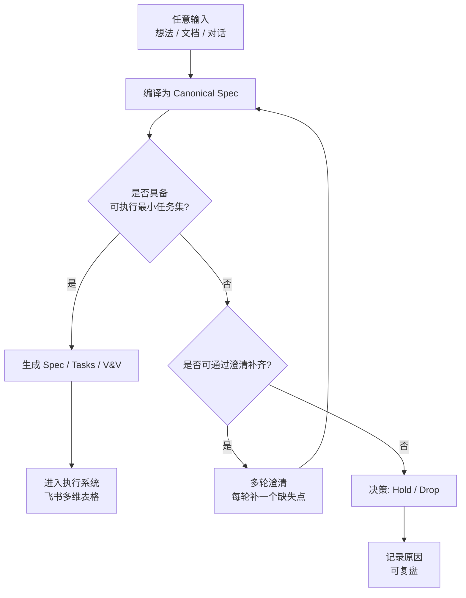

很好，这一轮其实已经**从“讨论方案”切换到“建立共同基线”**了。  
你现在要的不是更多设计，而是一个**能反复对齐认知的用户故事级文档 + 一张能快速 catch-up 的流程图**。  
我会按这个成功标准来写：

> **成功标准**  
> - 任何一个人（包括未来的你）读完，都能在 5–10 分钟内理解：  
>   1）系统解决什么问题  
>   2）为什么要选 B（必须产出可执行最小任务集）  
>   3）从“输入很烂”到“进入执行系统”的完整路径  
> - 文档是“业务视角 + 系统行为”，不提前陷入技术实现  
> - Flowchart 是“决策流”，不是技术架构图

---

# User Story 文档（Baseline v0.1）

## 1. 背景（Why）

在一个真实的软件研发环境中：

- 需求来源高度碎片化  
  - 灵感、想法、会议、临时讨论、Cursor 中的分析文本  
- 输入质量参差不齐  
  - 有的人写得很清晰  
  - 有的人只有一句话，甚至是半个念头  
- 真正昂贵的不是“写文档”，而是：
  - 重复澄清  
  - 低质量任务进入执行系统  
  - 执行到一半才发现“这个需求根本不值得做 / 做不下去”

**目标不是让所有人写好文档，而是让系统本身具备“判断 + 收敛”的能力。**

---

## 2. 核心目标（What）

构建一个**统一的需求编译与执行入口系统**，使其能够：

1. 接受任意质量的输入（从一句话到完整任务文档）
2. 自动判断：
   - 是否信息充分
   - 是否值得进入执行系统
3. 如果信息不足：
   - 主动进入多轮澄清
   - 每轮只聚焦一个需求
4. 最终**只在满足条件时**：
   - 产出 **可执行的最小任务集**
   - 并进入团队的执行系统（如飞书多维表格）
5. 如果不满足：
   - 给出 **Hold / Drop 的明确理由**，而不是模糊失败

---

## 3. 核心原则（Design Principles）

### P1. 所有路径，最终必须落到「可执行」
> 这是你选择 B 的根本原因

- Spec 不只是“写清楚”
- 而是必须**能拆出最小可执行任务**
- 如果拆不出来：
  - 说明需求仍然不成熟
  - 系统有义务阻止它进入执行系统

---

### P2. 澄清不是聊天，是“补齐缺失字段”
- 澄清由系统触发，不由用户自觉
- 每一轮澄清都必须：
  - 对应一个明确缺失项
  - 推动需求向“可执行”逼近
- 澄清失败 ≠ 系统失败  
  → **明确判定 Hold / Drop 也是成功结果**

---

### P3. 人负责决策，AI 负责编译
- AI 的职责：
  - 理解
  - 结构化
  - 指出不确定性与风险
- 人的职责：
  - 最终 Go / Hold / Drop
  - 人员分配、排期、资源承诺

---

## 4. 用户故事（User Stories）

### US-1：从零到一（模糊想法）

> **作为一个产品 / 技术负责人**  
> 我希望当我只有一个模糊想法时  
> 系统能通过多轮澄清，帮助我判断：
> - 这个需求是否值得做
> - 如果值得，最小可执行版本是什么  
> - 如果不值得，有清晰、可复盘的理由

**成功判定**  
- 最终产出以下之一：
  - 可执行最小任务集（进入执行系统）
  - Hold（等待条件）
  - Drop（明确放弃）

---

### US-2：已有项目背景，但输入质量不稳定

> **作为一个团队协作系统**  
> 我希望即便任务文档写得不清晰  
> 系统也能判断：
> - 是直接进入执行
> - 还是需要澄清  
> 而不是把不成熟的任务直接推给开发

**成功判定**  
- 只有当“可执行最小任务集”存在时  
  才允许进入飞书多维表格

---

### US-3：高质量输入的快速通道

> **作为一个经验丰富的工程师**  
> 当我已经写清楚任务文档时  
> 我不希望被迫进入冗长澄清流程

**成功判定**  
- 系统能识别“信息充分”
- 直接编译 → 执行系统
- 澄清成本 ≈ 0

---

## 5. 双场景 User Journey（简版）

### 场景A：从0到1（模糊输入）

1. **入口**：通过工具链输入一句话/碎片想法（CLI 为主入口；可视化界面如有也走同一 Pipeline）
2. **编译**：系统将输入编译为 Canonical Spec（初始多为 draft）
3. **Gate 判定**：若缺字段 → 进入澄清循环，聚焦补齐关键缺失项
4. **澄清循环**：用户回答问题 → 系统重编译并再判定，直到可执行
5. **任务化**：生成最小可执行任务集（Tasks）与验证项（V&V）
6. **人工确认**：Go / Hold / Drop 决策
7. **发布**：Go 则进入执行系统（Feishu），Hold/Drop 记录原因

### 场景B：已有项目背景（输入较完整）

1. **入口**：提交已有文档/背景信息（可附 repo context 作为证据来源）
2. **编译**：系统生成 Canonical Spec（目标、非目标、验收等字段更完整）
3. **Gate 判定**：通常直接通过，必要时触发最小澄清
4. **任务化**：生成 Tasks + V&V（保持最小可执行范围）
5. **人工确认**：Go / Hold / Drop
6. **发布**：Go 则发布到 Feishu，形成可执行条目

---

## 6. 系统行为（Behavioral Contract）

### 输入（Input）
- 一句话
- 多轮对话
- Cursor 任务文档
- 项目目录 / Repo Context（可选）

---

### 中间态（Canonical Spec）
系统内部维护一份**唯一可信规格**，包含：

- 目标与非目标
- 已知假设
- 风险与不确定性
- 可执行最小任务集（是否存在）
- 决策建议（Go / Hold / Drop）

---

### 输出（Output）

#### 情况 A：可执行
- Spec → Tasks → V&V 完整闭环
- 进入执行系统（如飞书多维表格）

#### 情况 B：不可执行
- 明确缺失点
- 明确 Hold / Drop 原因
- 可在未来继续澄清，而不是重来

---

## 6. 决策 Flowchart（Baseline）

> 这是你要的 **catch-up flowchart**  
> 我先给“业务决策版”，不是技术版

---

## 7. 本阶段明确「不做什么」（Non-Goals）

- ❌ 不在这一阶段解决：
  - 具体技术栈
  - LLM 选择
  - 飞书 API 细节
- ❌ 不追求一次对话解决所有需求
- ❌ 不强迫所有用户改变写作习惯

---

## 8. 下一步自然演进路径（你已经站在这里了）

在这个 baseline 下，接下来**非常顺**：

1. 抽象 **Canonical Spec 的最小字段集（MVP）**
2. 定义：
   - “什么叫可执行最小任务集”
3. 对照你已有的：
   - feishu-onboarding-tool
   - RequirementDocGen  
   看哪些是：
   - 可复用
   - 需要补一层
4. 再谈技术方案与验收标准（会非常具体）

---

如果你愿意，下一轮我建议我们做 **一件非常落地的事**：

> **从这个文档中，抽出 Canonical Spec 的 MVP Schema（字段 + 判定规则）**  

这是从“业务框架”迈向“可实现系统”的关键一步，而且不会跳太远。