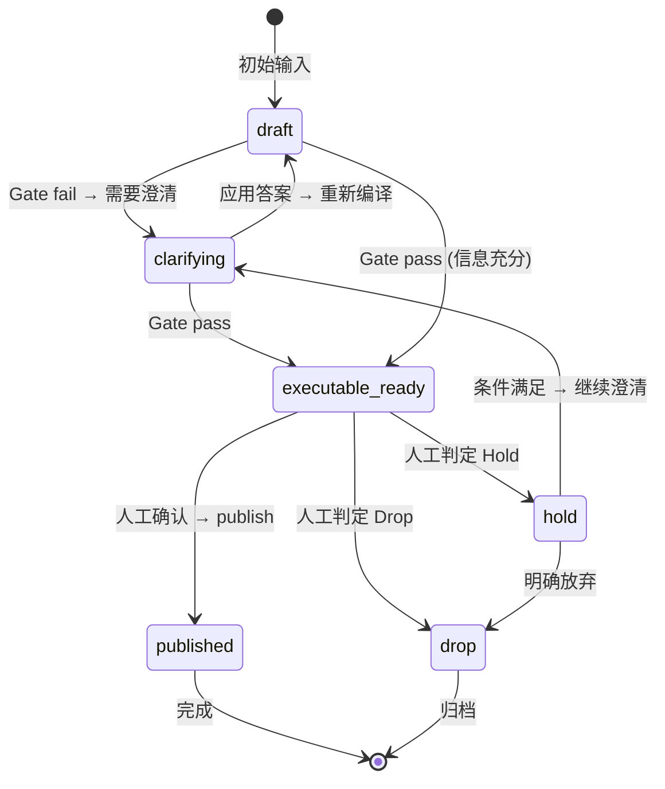

# MVP 范围与术语表

## MVP 范围

### 本期目标（In-Scope）
- **单一执行系统**：仅支持 Feishu 多维表格（需求池表），严格复用现有表结构
- **单一入口**：Tooling-first（CLI/命令式工具），嵌入现有工具链（如 `feishu-onboarding-tool`），暂不支持 Web UI/独立 API 服务
- **核心流程**：输入 → 编译 → Gate 判定 → CLI 人工确认 → 发布到 Feishu
- **Gate 策略**：硬必填通过 + CLI 人工确认（score 仅用于辅助决策）
- **前端体验约束**：历史需求列表默认折叠，当前需求创建/细化为主视图（历史列表仅通过“查看历史”展开）

### 明确不做什么（Out-of-Scope）
- ❌ 不支持 Jira/GitHub Issues/Notion 等其他执行系统（未来扩展）
- ❌ 不支持修改 Feishu 表结构（不新增字段/不改字段类型）
- ❌ 不支持自动放行 publish（必须人工确认）
- ❌ 不支持多 feature 批量处理（每轮一个需求）
- ❌ 不支持可视化编排/平台化（未来方案4）

## 术语表

| 术语 | 定义 | 示例 |
|------|------|------|
| **Feature** | 单个需求/功能点，是 Canonical Spec 的承载单位 | `F-2026-001` |
| **Spec Version** | Canonical Spec 的不可变版本标识 | `S-20260113-0003` |
| **Run ID** | 单次 Pipeline 执行的唯一标识 | `R-20260113-0008` |
| **Publish Record** | 发布到执行系统的记录（Ledger 中的条目） | `feature_id + target + spec_version → external_id` |
| **External ID** | 执行系统（Feishu）返回的记录ID | `recv83AoVSDMQP` |
| **Gate** | 确定性判定点（硬必填 + 加权评分） | Gate S/T/V |
| **Canonical Spec** | 唯一事实源，系统内部的结构化规格 | JSON Schema |
| **Mapping Config** | 字段映射配置（Canonical Spec → Feishu 字段） | YAML/JSON 配置文件 |

## 状态机与流转规则

### 状态定义

| 状态 | 含义 | 允许操作 |
|------|------|----------|
| `draft` | 初始草稿，信息不完整 | 编译、澄清 |
| `clarifying` | 正在澄清中（等待用户回答） | 应用答案、继续澄清 |
| `executable_ready` | 硬必填通过，可进入人工确认队列 | 人工确认、publish |
| `published` | 已发布到执行系统 | 查看、更新（新版本） |
| `hold` | 暂缓（等待条件） | 继续澄清、drop |
| `drop` | 明确放弃 | 归档 |

### 合法流转

### 约束规则
- **不可回退**：`published` 状态不可回退到 `executable_ready`（只能发布新版本）
- **版本不可变**：`spec_version` 一旦生成不可修改（新版本必须生成新的 `spec_version`）
- **并发控制**：同一 `feature_id` 同时只能有一个 `clarifying` 或 `executable_ready` 状态

## 验收标准（定义完成）

- [x] MVP 范围与非目标明确
- [x] 术语表完整（8 个核心术语）
- [x] 状态机定义清晰（6 个状态 + 合法流转图）
- [x] 约束规则可执行（不可回退、版本不可变、并发控制）
