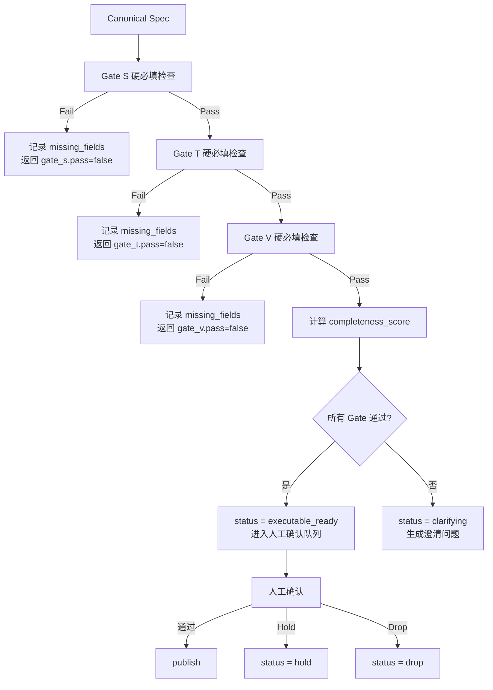

# Gate 模型（确定性骨架）

## 层级定义
**层级名称**：Deterministic Gates（确定性骨架）  
**数据源（SoT）**：Canonical Spec（输入）  
**核心程序**：Gate Engine（确定性计算，不依赖 LLM 主观判断）

## 输入
- **Canonical Spec**：完整的 spec 对象（`meta.spec_version` 必须存在，且为不可变版本标识）
- **Gate Context**（可选）：`project_context_ref`、历史 Gate 结果

**注意**：Gate Engine 是只读操作，不修改 Spec 内容，不生成新 `spec_version`。Gate 结果仅用于判定是否进入下一步骤。

## 输出结构

### Gate Result JSON

```json
{
  "gate_s": {
    "pass": true,
    "missing_fields": [],
    "reasons": []
  },
  "gate_t": {
    "pass": false,
    "missing_fields": [
      { "path": "planning.tasks", "reason": "tasks 数量为 0，无法形成可执行最小任务集" }
    ],
    "reasons": ["Gate T fail: 至少需要 1 个 task"]
  },
  "gate_v": {
    "pass": false,
    "missing_fields": [
      { "path": "planning.vv", "reason": "task T-1 没有绑定的 vv" }
    ],
    "reasons": ["Gate V fail: 每个 task 至少需要 1 个 vv"]
  },
  "completeness_score": 0.65,
  "weighted_details": {
    "goal_quality": 0.8,
    "acceptance_criteria_quality": 0.7,
    "tasks_quality": 0.5,
    "vv_quality": 0.4
  },
  "overall_pass": false,
  "next_action": "clarify",
  "clarify_questions": [
    { "field_path": "planning.tasks", "question": "请提供至少 1 个可执行任务" }
  ]
}
```

## 硬必填清单（Hard Required）

### Gate S（Specification Completeness）
**判定规则**：以下字段必须存在且非空

| 字段路径 | 必填条件 | Fail 原因 |
|---------|---------|----------|
| `spec.goal` | 非空字符串，长度 ≥ 10 | "Gate S fail: goal 缺失或长度不足" |
| `spec.non_goals` | 数组（可为空 `[]`） | "Gate S fail: non_goals 格式错误" |
| `spec.acceptance_criteria` | 数组，长度 ≥ 1 | "Gate S fail: acceptance_criteria 数量为 0" |
| `spec.acceptance_criteria[].id` | 每个元素必须有 `id` | "Gate S fail: acceptance_criteria 缺少 id" |
| `spec.acceptance_criteria[].criteria` | 每个元素必须有 `criteria` | "Gate S fail: acceptance_criteria 缺少 criteria" |

**通过条件**：所有字段满足 → `gate_s.pass = true`

### Gate T（Tasks Existence）
**判定规则**：publish 前必须满足

| 字段路径 | 必填条件 | Fail 原因 |
|---------|---------|----------|
| `planning.tasks` | 数组，长度 ≥ 1（publish 前） | "Gate T fail: tasks 数量为 0，无法形成可执行最小任务集" |
| `planning.tasks[].task_id` | 每个元素必须有 `task_id` | "Gate T fail: task 缺少 task_id" |
| `planning.tasks[].title` | 每个元素必须有 `title` | "Gate T fail: task 缺少 title" |
| `planning.tasks[].type` | 每个元素必须有 `type`（枚举值） | "Gate T fail: task 缺少 type 或 type 无效" |
| `planning.tasks[].scope` | 每个元素必须有 `scope` | "Gate T fail: task 缺少 scope" |

**通过条件**：所有字段满足 → `gate_t.pass = true`  
**注意**：`draft` 状态允许 `tasks = []`，但 `executable_ready` 状态必须 `tasks.length ≥ 1`

### Gate V（Verification & Validation）
**判定规则**：publish 前必须满足

| 字段路径 | 必填条件 | Fail 原因 |
|---------|---------|----------|
| `planning.vv` | 数组，长度 ≥ `planning.tasks.length`（publish 前） | "Gate V fail: vv 数量少于 tasks 数量" |
| `planning.vv[].vv_id` | 每个元素必须有 `vv_id` | "Gate V fail: vv 缺少 vv_id" |
| `planning.vv[].task_id` | 每个元素必须有 `task_id`，且必须引用存在的 task | "Gate V fail: vv 的 task_id 不存在" |
| `planning.vv[].procedure` | 每个元素必须有 `procedure` | "Gate V fail: vv 缺少 procedure" |
| `planning.vv[].expected_result` | 每个元素必须有 `expected_result` | "Gate V fail: vv 缺少 expected_result" |

**通过条件**：所有字段满足 + 每个 task 至少 1 个 vv → `gate_v.pass = true`  
**注意**：`draft` 状态允许 `vv = []`，但 `executable_ready` 状态必须满足绑定关系

## 加权评分模型（Weighted Score）

### 评分维度与权重

| 维度 | 权重 | 取值范围 | 计算方式 |
|------|------|----------|----------|
| `goal_quality` | 0.3 | 0.0-1.0 | `goal` 长度合理性（10-500 为满分）+ 结构化程度 |
| `acceptance_criteria_quality` | 0.25 | 0.0-1.0 | 数量（≥3 为满分）+ 可验证性（包含 test_hint 加分） |
| `tasks_quality` | 0.25 | 0.0-1.0 | 数量（≥3 为满分）+ 类型多样性 + 依赖关系完整性 |
| `vv_quality` | 0.2 | 0.0-1.0 | 覆盖率（每个 task 都有 vv）+ 类型多样性 |

### 计算公式

```
completeness_score = 
  goal_quality * 0.3 +
  acceptance_criteria_quality * 0.25 +
  tasks_quality * 0.25 +
  vv_quality * 0.2
```

### 确定性计算规则（示例）

#### `goal_quality` 计算
```python
def calculate_goal_quality(goal: str) -> float:
    if not goal or len(goal) < 10:
        return 0.0
    length_score = min(1.0, len(goal) / 500)  # 长度分
    structure_score = 0.5 if "目标" in goal or "解决" in goal else 0.3  # 结构化分
    return (length_score * 0.6 + structure_score * 0.4)
```

#### `acceptance_criteria_quality` 计算
```python
def calculate_ac_quality(ac_list: List) -> float:
    if len(ac_list) == 0:
        return 0.0
    count_score = min(1.0, len(ac_list) / 3)  # 数量分（≥3 为满分）
    test_hint_score = sum(1 for ac in ac_list if ac.get("test_hint")) / max(len(ac_list), 1)  # 可验证性
    return count_score * 0.7 + test_hint_score * 0.3
```

**关键约束**：所有计算必须是**确定性函数**（给定输入，输出唯一），不依赖 LLM 或随机性。

## 策略：硬必填 + 人工确认

### 判定流程



### 关键规则
1. **硬必填通过 ≠ 自动 publish**：`gate_s.pass && gate_t.pass && gate_v.pass` 仅意味着可进入 `executable_ready` 状态
2. **人工确认是必须的**：`executable_ready` → `published` 必须经过人工确认步骤
3. **Score 仅用于辅助**：`completeness_score` 用于：
   - 排序（在人工确认队列中）
   - 提示（显示质量评估）
   - 不用于自动放行

## 检验标准

### 可重放性
- **同一 Spec 多次计算**：给定相同的 Canonical Spec，多次调用 Gate Engine 必须产生相同的 `gate_result`（包括 `completeness_score`）
- **确定性函数**：所有计算逻辑不得依赖随机数、时间戳、LLM 调用

### 错误处理策略
- **Spec 格式错误**：返回错误，不执行 Gate（不可重试）
- **必填字段缺失**：记录到 `missing_fields`，返回对应 Gate `pass=false`（继续流程，进入澄清）
- **计算异常**：返回错误，记录到日志（可重试，但 Gate Engine 本身是确定性函数，不应出现异常）

### 失败姿势

| 失败场景 | 处理方式 | 输出 |
|---------|---------|------|
| Spec 格式错误（JSON 解析失败） | 返回错误，不执行 Gate | 错误信息 |
| 必填字段缺失 | 记录到 `missing_fields`，返回对应 Gate `pass=false` | Gate Result |
| 计算异常 | 返回错误，记录到日志 | 错误信息 + 日志 |
