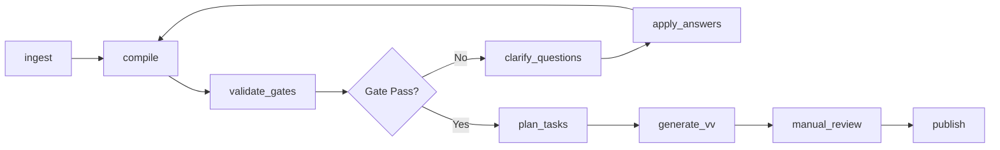

# Orchestrator Steps I/O（步骤编排与状态机）

## 层级定义
**层级名称**：Pipeline Orchestrator（步骤编排与状态机）  
**数据源（SoT）**：Step Snapshot Store + Evidence Store  
**核心程序**：Orchestrator（单体内模块化，状态机驱动）

## 输入
- **用户输入**：任意质量（一句话/对话/文档）
- **Project Context Ref**（可选）：`project_id` + `context_version`
- **Run ID**：单次 Pipeline 执行的唯一标识（格式：`R-YYYYMMDD-NNNN`）

## 输出
- **Canonical Spec**：`meta.spec_version`（新生成或更新）
- **Gate Result**：`gate_result`（pass/fail + missing_fields + score）
- **Publish Request**（可选）：人工确认后的发布请求

## Step Pipeline（MVP 最小步骤集）

### 步骤列表与顺序



### 步骤定义表

| Step Name | 输入 | 输出 | 核心程序 | 失败处理 |
|-----------|------|------|----------|----------|
| `ingest` | 用户输入 + context_ref | `ingest_result`（结构化输入） | Input Parser | 返回错误，不继续 |
| `compile` | `ingest_result` + context_ref | `spec_version_out`（新生成） | LLM Compiler | 返回错误，记录到 Evidence；成功时**必须生成新 spec_version** |
| `validate_gates` | `spec_version_in` | `gate_result` | Gate Engine | 记录 missing_fields，继续流程；**不修改 Spec，不生成新版本** |
| `clarify_questions` | `gate_result.missing_fields` | `questions[]` | LLM Compiler（提问生成） | 返回错误，记录到 Evidence；**不修改 Spec，不生成新版本** |
| `apply_answers` | `user_answer` + `spec_version_in` | `spec_version_out`（新生成） | LLM Compiler（答案应用） | 返回错误，记录到 Evidence；成功时**必须生成新 spec_version** |
| `plan_tasks` | `spec_version_in` | `spec_version_out`（新生成）+ `tasks[]` | LLM Compiler（任务规划） | 返回错误，记录到 Evidence；成功时**必须生成新 spec_version** |
| `generate_vv` | `spec_version_in` + `tasks[]` | `spec_version_out`（新生成）+ `vv[]` | LLM Compiler（VV 生成） | 返回错误，记录到 Evidence；成功时**必须生成新 spec_version** |
| `manual_review` | `spec_version_in` + `gate_result` | `review_decision`（go/hold/drop） | 人工确认（CLI/工具） | 等待人工输入；**不修改 Spec，不生成新版本** |
| `publish` | `spec_version_in` + `review_decision=go` | `publish_result`（external_id） | Feishu Publisher | 返回错误，记录到 Ledger；**不修改 Spec，不生成新版本**；幂等键：`feature_id + target + spec_version` |

## Clarify Loop 体验约束（核心体验）
1. **历史记录默认折叠**：澄清页面主区域默认聚焦当前需求与问题列表，历史列表仅通过“查看历史”入口展开。
2. **当前需求为主**：细化流程中的当前轮内容必须保持主视觉区域优先级，避免历史内容占据主要空间。

## Step Snapshot 结构（证据链）

### Snapshot JSON Schema

```json
{
  "run_id": "R-20260113-0008",
  "feature_id": "F-2026-001",
  "spec_version_in": "S-20260113-0002",
  "spec_version_out": "S-20260113-0003",
  "step": {
    "name": "validate_gates",
    "seq": 4,
    "started_at": "2026-01-13T10:05:01Z",
    "ended_at": "2026-01-13T10:05:02Z"
  },
  "inputs": {
    "canonical_spec_ref": "S-20260113-0002",
    "context_ref": "C-12",
    "user_answer_ref": null
  },
  "outputs": {
    "gate_result": {
      "gate_s": { "pass": true },
      "gate_t": { "pass": false },
      "completeness_score": 0.65
    },
    "spec_version_out": "S-20260113-0003"
  },
  "decisions": [
    {
      "decision": "enter_clarify_loop",
      "reason": "GateT fail: tasks missing",
      "next_step": "clarify_questions"
    }
  ],
  "evidence_links": [
    { "type": "quote", "evidence_id": "E-1001" },
    { "type": "repo_ref", "evidence_id": "E-1002" }
  ],
  "errors": [],
  "meta": {
    "engine_version": "orchestrator-0.1",
    "llm_model": "gpt-4",
    "extensions": {}
  }
}
```

### Snapshot 字段表

| 字段路径 | 必填 | 用途 | 校验规则 |
|---------|------|------|----------|
| `run_id` | ✅ | 执行追踪 | 格式：`R-YYYYMMDD-NNNN` |
| `feature_id` | ✅ | Feature 关联 | 格式：`F-YYYY-NNN` |
| `spec_version_in` | ✅ | 输入版本 | 格式：`S-YYYYMMDD-NNNN` |
| `spec_version_out` | ⚠️ | 输出版本 | 可为 null（如果 step 失败），否则格式同上 |
| `step.name` | ✅ | Step 标识 | 枚举值（见步骤列表） |
| `step.seq` | ✅ | 执行顺序 | 整数，从 1 开始 |
| `step.started_at` | ✅ | 审计 | ISO 8601 |
| `step.ended_at` | ✅ | 审计 | ISO 8601 |
| `outputs` | ✅ | Step 输出 | 结构取决于 step（见步骤定义表） |
| `decisions` | ✅ | 决策记录 | 数组（可为空 `[]`） |
| `evidence_links` | ✅ | 证据链 | 数组（可为空 `[]`） |
| `errors` | ✅ | 错误记录 | 数组（可为空 `[]`） |

## Evidence 结构（引用/来源）

### Evidence JSON Schema

```json
{
  "evidence_id": "E-1001",
  "type": "quote|doc|repo|file|api_result|log",
  "source": {
    "ref": "doc://task_md#L20-L35",
    "hash": "sha256:..."
  },
  "content": {
    "excerpt": "不超过必要的短引用/摘要",
    "note": "这段证据用于支持某个字段抽取/某个决策"
  },
  "linked_to": [
    { "spec_path": "spec.goal" },
    { "step": "compile" }
  ],
  "created_at": "2026-01-13T10:04:00Z"
}
```

### Evidence 字段表

| 字段路径 | 必填 | 用途 | 校验规则 |
|---------|------|------|----------|
| `evidence_id` | ✅ | 唯一标识 | 格式：`E-NNNN` |
| `type` | ✅ | 证据类型 | 枚举值（quote/doc/repo/file/api_result/log） |
| `source.ref` | ✅ | 来源引用 | 字符串（格式取决于 type） |
| `source.hash` | ⚠️ | 内容哈希 | 可选，用于验证内容未变更 |
| `content.excerpt` | ✅ | 引用片段 | 字符串，长度 ≤ 500 |
| `linked_to` | ✅ | 关联目标 | 数组，至少 1 个元素 |

## 约束规则

### 硬约束
1. **每个 Step 必须产出 Snapshot**：无论成功/失败，都必须记录到 Snapshot Store
2. **关键决策必须可解释**：`decisions[]` 必须包含 `reason` + `next_step`
3. **Step 输入输出必须是 JSON**：方便未来配置化/可视化（方案4）

### 软约束
- `step.ended_at` - `step.started_at` 应记录执行时长（用于性能监控）
- `evidence_links` 应尽可能完整（用于审计/回放）

## 检验标准

### 可重放性
- **给定 inputs + context + spec_version_in**：可以重跑 step 得到同类输出（LLM 调用可能产生差异，但 Gate 结果必须一致）
- **Snapshot 完整性**：每个 step 的 snapshot 必须包含足够的上下文，支持未来回放
- **版本不可变性**：任何修改 Spec 内容的 step（`compile`、`apply_answers`、`plan_tasks`、`generate_vv`）成功执行后必须生成新的 `spec_version`，旧版本不可修改。只读步骤（`validate_gates`、`clarify_questions`、`manual_review`、`publish`）不生成新版本。

### 错误处理策略（统一策略）

#### 错误分类
1. **可重试错误**（网络超时、LLM 限流、临时服务不可用）
   - **策略**：自动重试（最多 3 次，指数退避）
   - **记录**：记录到 `errors[]`，包含重试次数和最终结果
   - **降级**：重试失败后，返回错误，不生成新 `spec_version`

2. **不可重试错误**（输入格式错误、权限不足、配置缺失）
   - **策略**：立即返回错误，不重试
   - **记录**：记录到 `errors[]`，包含错误码和详细说明
   - **降级**：返回错误，不生成新 `spec_version`

3. **部分成功**（LLM 返回部分字段，但关键字段缺失）
   - **策略**：记录到 `missing_fields[]`，继续流程（进入澄清）
   - **记录**：记录到 `evidence_links[]`，标记为"部分成功"
   - **降级**：生成 `draft` 状态 Spec，进入澄清流程

#### 错误通知
- **CLI 输出**：错误信息输出到 `stderr`，包含错误码、建议操作、日志路径
- **日志文件**：所有错误记录到 `~/.canonical/logs/orchestrator-YYYYMMDD.log`
- **Evidence Store**：关键错误记录到 Evidence Store，关联到 Step Snapshot

### 失败姿势

| 失败场景 | 处理方式 | 输出 |
|---------|---------|------|
| Step 执行异常 | 记录到 `errors[]`，`spec_version_out = null` | Snapshot（含错误） |
| LLM 调用失败（可重试） | 自动重试 3 次，失败后记录到 `errors[]`，返回错误 | Snapshot（含错误） + 重试记录 |
| LLM 调用失败（不可重试） | 立即返回错误，记录到 `errors[]` | Snapshot（含错误） |
| 状态机流转错误 | 返回错误，不生成 Snapshot | 错误信息 |
| 部分成功（关键字段缺失） | 记录到 `missing_fields[]`，生成 `draft` Spec | Snapshot + Spec（draft 状态） |